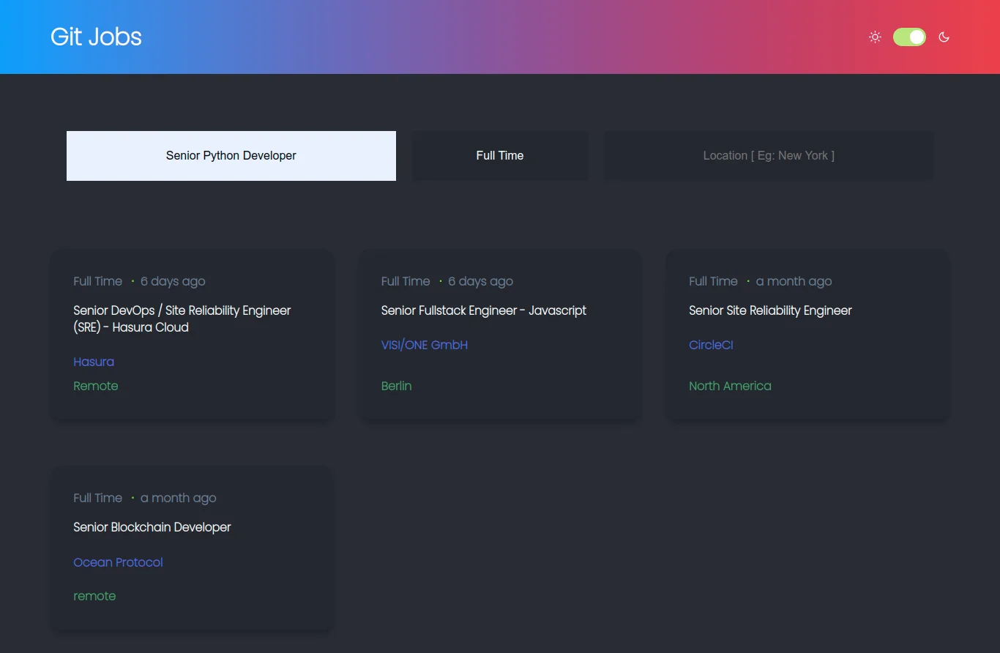

## Github Jobs
### React Web Application using Github Jobs API

### Live Demo

[](https://githubjobsapi.netlify.app/)


[Click here to see it live](https://githubjobsapi.netlify.app/)


## Installation
```
git clone https://github.com/neeraj1bh/GithubJobsAPI.git
cd [foldername]
npm install && npm run dev

```

## Features
- User can search and apply for jobs
- View detailed information for every job.
- Filter Jobs based on position or location
- Pagination

## External Libraries
- [React Markdown](https://github.com/remarkjs/react-markdown.git) 
- [Axios](https://github.com/axios/axios)
- [Moment JS](https://github.com/moment/moment.git) 
